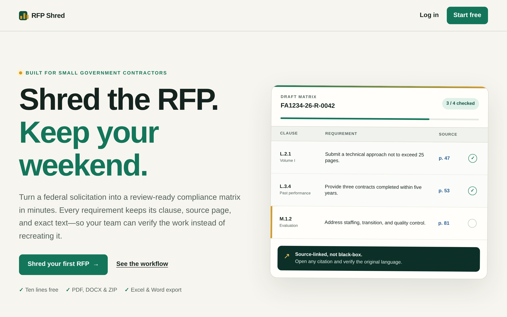
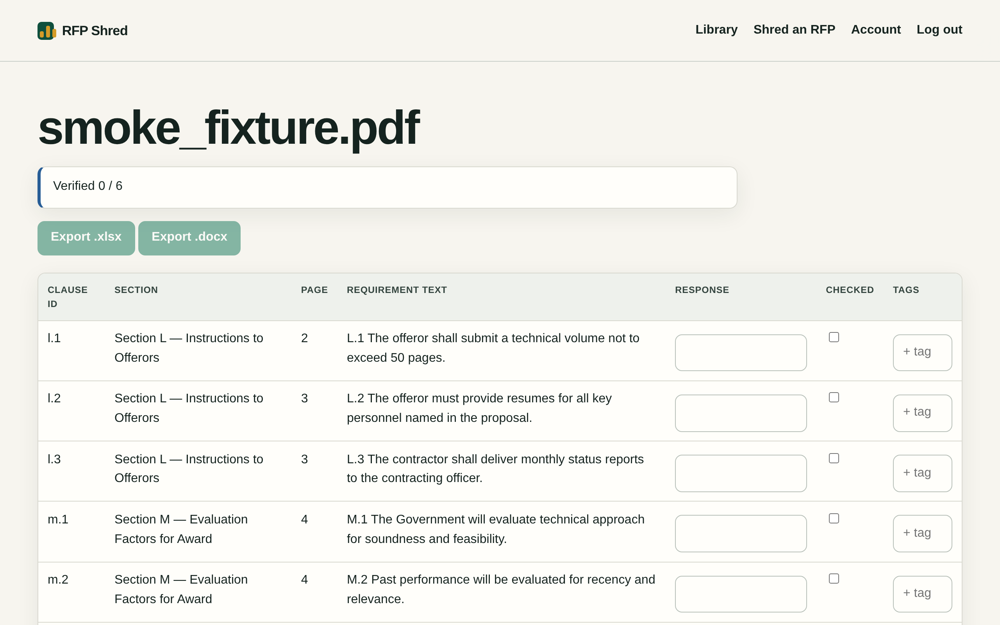

<div align="center">

# RFP Shred

**Shred the RFP. Keep your weekend.**

Upload a federal solicitation (PDF, DOCX or ZIP). Get back a draft **compliance matrix** in which every line cites its exact page and clause and carries the full requirement text. It replaces the 6–12 hour weekend of shredding by hand.




</div>

---

## Why this exists

Small government contractors answer RFPs by hand. Someone reads the whole solicitation, copies every "shall" and "must" into a spreadsheet, and tracks where each one came from. It's slow and error-prone, and if a single requirement slips through, the bid can be ruled non-compliant.

RFP Shred does the extraction and never asks for blind trust. **Every row quotes its source page.** Rows the noise filter or the citation audit drops stay reviewable and can be put back. **Nothing exports until a human has checked every line.**

<div align="center">

<br><sub>The real showcase journey: the committed sample PDF becomes six source-cited rows, and both exports stay locked until the last one is checked.</sub>
</div>

## What you get

| | |
|---|---|
| **Core loop** | upload → machine read → draft matrix → **mandatory human check** → export |
| **Exports** | `.xlsx` and `.docx`, six columns: Clause ID · Section · Source Page · Requirement Text · Response · Checked |
| **Trust surfaces** | page-quoting citation audit; reviewable, restorable filter and audit drops; export gate |
| **Founder alert loop** | nightly SAM.gov sweep against your own NAICS / set-aside watchlist, plus a daily digest email |
| **Pricing (beta, as specified)** | ten lines free on every solicitation · $149 opens one matrix · $249/month opens everything |

## Try it in one command

The showcase runs the real product: web app, SQLite-backed job queue, background worker, deterministic local extractor, citation audit, review gate, and Excel/Word exports. You don't need Docker, a model key, Stripe, a SAM.gov key or a mail server.

```bash
make setup     # uv sync --frozen --extra dev --python 3.12
make demo
```

Open **http://127.0.0.1:8180**, create an account with any password of 12 or more characters, and upload the committed sample:

```text
tests/fixtures/corpus/smoke_fixture.pdf
```

The journey: upload → background extraction → **six source-cited rows** → check every row → both exports unlock. Showcase state is isolated under `.demo/`.

## Stack

Python 3.12 · FastAPI (server-rendered Jinja2 plus a JSON API) · PostgreSQL 16, which is also the job queue (no Redis) · Stripe Checkout · a single Docker image serving the `api`, `worker` and `sweep` roles · Caddy in front for TLS.

## Run it with Docker

```bash
git clone <this-repo-url> rfp-shred && cd rfp-shred
cp .env.example .env          # placeholders run the dev stack (mock model, stub checkout, outbox mail)

docker compose -f deploy/compose.yml up -d postgres
docker compose -f deploy/compose.yml run --rm api alembic upgrade head
docker compose -f deploy/compose.yml up -d api worker sweep

# corpus fixtures (annotations + manifest are in-repo; PDFs come from SAM.gov or are synthetic)
docker compose -f deploy/compose.yml run --rm api python -m scripts.download_corpus --mock-corpus

# operator bootstrap (required before /ops console access)
docker compose -f deploy/compose.yml run --rm api python -m scripts.create_staff --email founder@example.com

curl -fsS http://localhost:8080/healthz
```

The dev stack uses `MODEL_PROVIDER=mock` (a deterministic local extractor that needs no API key), a stub checkout, and mail written to `files/outbox/`. **Production mode refuses those showcase defaults.** Before launch, configure a real provider, an HTTPS public URL, billing and mail.

### Production

Replace every placeholder in `.env`: model provider and key, Stripe credentials and price IDs, SMTP, SAM.gov key, and an HTTPS `PUBLIC_URL`. Then:

```bash
PUBLIC_HOST=rfp.example.com \
  docker compose -f deploy/compose.yml -f deploy/compose.prod.yml \
  --env-file .env up -d
```

The production overlay refuses a missing `PUBLIC_HOST`. It runs `alembic upgrade head` as a one-shot prerequisite and starts the API, worker and sweep only after migration succeeds. Only Caddy publishes ports 80 and 443; the API stays private to the Compose network.

## Tests

```bash
make test        # whole app on SQLite, no Docker needed
make quality     # coverage floor (80%) + syntax-critical lint

# extraction falsification harness
python3 -m scripts.evaluate_extraction --corpus tests/fixtures/corpus

# content-verified smoke against a live server
./scripts/smoke.sh http://localhost:8080

# production-parity suite in Docker
docker compose -f deploy/compose.yml -f deploy/compose.test.yml run --rm api \
  pytest -q --cov=app --cov-report=term --cov-fail-under=80
```

On Python 3.12 the local suite reports **188 passed, 3 skipped, 85% line coverage**. On the showcase fixture the falsification harness measures **6 of 6 binding requirements matched, with 0% omissions, 0% false positives and 0% page-attribution error**. The harness itself says the omission rate is a lower bound until a second expert reviews it.

## Security posture

- Server-side sessions: opaque tokens, SHA-256 hashed at rest, 7-day sliding expiry
- CSRF synchronizer tokens on browser state changes, and same-origin pre-auth forms
- argon2id password hashing
- Spreadsheet exports neutralize formula injection across source, model and user text
- Foreign and nonexistent resources return identical 404s
- Append-only audit log, enforced by a database trigger
- Stripe webhooks verified with a stdlib signature check; late events can't revive a cancelled subscription
- A pure-ASGI upload gate enforces size and concurrency limits *before* parsing, with typed 413/503 responses
- Baseline browser security headers; in-memory rate limits (single Uvicorn worker, documented)

## Repository layout

```
app/
  core/       config, db engine, db-backed queue, security/CSRF, rate limit,
              model client + adapters, usage cap, maintenance, mailer
  web/        routes, Jinja2 templates, static assets, intake, exports
  pipeline/   pagemap, sub-PDF OCR, mine, audit, filter, transform, runner
  billing/    checkout, webhook, entitlement
  sweep/      SAM.gov client, watchlist matcher, scheduler, digest
  ops/        founder console (sweeps, quality, audit)
  worker/     worker entrypoint
alembic/      schema migrations (all 20 tables + append-only trigger)
deploy/       Dockerfile, compose.yml, compose.prod.yml, compose.test.yml, Caddyfile
scripts/      evaluate_extraction, create_staff, download_corpus, trigger_sweep,
              backfill_sam, smoke.sh, export_annotations, export_corrections, demo
tests/        unit, e2e and API suites; fixtures/corpus
```

Every environment variable is documented in `.env.example`. `app/core/config.py` refuses a strict boot when a required name is missing.

## Where the evidence stops

The suite exercises the whole deterministic product and the showcase PDF end to end. The extraction-quality corpus, though, is deliberately small: its committed gate contains **one** digital fixture. That's enough for a repeatable showcase, not for a claim that every federal solicitation, scan quality and agency layout is supported. Before public production, curate and independently annotate at least ten representative PDF/DOCX/ZIP packages, including scanned and multi-document solicitations, and run the falsification harness against a held-out set. `FINALIZER_REPORT.md` has the full list of what the finalizer changed and why.

## How it was made

Nobody told Sneferu to build an RFP tool. Its **business pipeline** got a looser brief: *find a painful, recurring workflow that a narrow professional audience lives with, and that one founder could solve in 12 weeks on $5,000.* It mapped opportunities, scored a portfolio, ran a kill tournament, and after the operator's pick it locked the concept. Then it wrote the product contract, and its independent coder and reviewer seats built the code over three cooperative rounds. A post-run finalizer pass then hardened extraction integrity, security and billing correctness, and packaged the showcase.

Run `2026-07-25T01-59-16Z-pipeline-a5eb676f`. `LINEAGE.json` binds the idea, concept lock and approved spec by hash, and `SOURCE_MANIFEST.json` binds the source tree.

**Runtime link to Sneferu:** none. Sneferu built RFP Shred, and it runs on its own.

<div align="center">

---

**Built by [Sneferu](https://sneferu.ai)**

<sub>README by Claude (Anthropic).</sub>

</div>
